<h2>Multi-Label Categorization of Construction Project Requirements Using Natural Language Processing (NLP) Technique </h2>

<h3> Project Overview </h3>
In construction contracts, project requirements contain needs, wishes, and expectations of the client towards a physical facility (e.g., buildings, bridges). Precise understanding of project requirements throughout the project life cycle from the early conceptual design is critical to allow a delivery that fully meets the owner’s expectations without costly redesign and rework. Since requirements are described only in text papers (e.g. contracts, specifications, government codes, drawings), requirement processing is currently extremely laborious, tedious, and errorprone, where an individual would examine the requirements and manually specify which statements are related to which parties in the contract. The contract agreements and technical specifications are enormous and include detailed instructions for all disciplines and project participants in a single document. The conventional approach to extract the scope of work for each disciple requires professionals to read the complete document word by word and to extract the information related to their tasks and discipline. The focus of this study is to determine suitable approaches to perform requirement extraction and categorization, and to test their performance on a dataset. This project will give the direction to transform the way construction professionals perform their work to translate the owner expectations. By taking advantage of emerging NLP technologies, the project is expected to introduce new ideas in construction planning and designing by replacing the old laborious methods of reading the contractual documents manually for information extraction and understanding.

<h3> Methodology </h3>
Following major tasks have been performed in this study by the project participants to achieve the desired results. Figure 1 shows the methodology used for text classification.
<ol>
  <li> Data Collection and preparation of Dataset </li>
  <li> Data Pre-processing </li>
  <li> Feature Engineering/Features Selection </li>
  <li> Development of Classification Models  </li>
</ol>

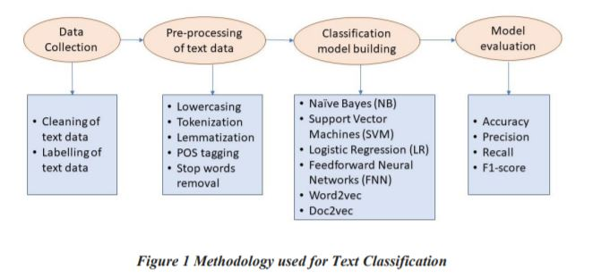

<h3> 1.1 Data Collection and preparation of Dataset </h3>
Firstly, we met the industry practitioners and requested them to provide us the required data. We collected contract documents and project performance reports from industry practitioners. The data is in the form of text documents (PDFs or Word Documents) and also includes standards and project specifications. After collection of entire data required for the project, we carefully studied the data and remove any useless data files. The data to be used is collected at one place after removal of extra data.

<h3> 1.2 Data Pre-Processing </h3> 
After collection and analysis of data, we started pre-processing and cleaning of this data which is one of the major tasks in natural language processing. We use python 3.6 for this purpose and used different libraries available in python to perform different tasks of pre-processing of data which involves Label Generalization or Standardization / Data Labelling, Tokenization, Stop Words Removal, Parts of Speech (POS) Tagging and Lemmatization

<h4> 1.2.1 Lowercasing and Punctuation Removal </h4>
Firstly, we convert all the text read from the document into lowercase because python interprets “Design” and “design” as two different terms. Therefore, the whole text was converted to lowercase to reduce the size of training data. The punctuations are also removed as they do not contribute towards text classification but unnecessarily increase the size of dataset and subsequently reduce the testing speed of algorithm. 

<h4> 1.2.2 Tokenization  </h4>
We performed tokenization of the whole text in which each entry in the corpus is broken down into a set of words. Usually, we take a single word as one token in our unigram classification model

<h4> 1.2.3 Stop words Removal </h4>
Stop words are the words that appear frequently in the text and has less meaning and contribution towards the text classification goal, so such words are removed before passing the text into the classification model. We removed all the English stop words from out dataset before testing our model.

<h4> 1.2.4 POS tagging  </h4>
POS tagging provides extra information in the text regarding which term is Noun, verb, adjective, etc. This step gives additional semantic and contextual information to the model to improve its performance.

<h4> 1.2.5 Stemming </h4> 
Stemming is the process of removing inflectional and sometimes derivational affixes to a base form that all of the original words are probably related to. Stemming usually refers to a crude heuristic process that chops off the ends of words in the hope of achieving this goal correctly most of the time, and often includes the removal of derivational affixes. Stemming reduces word-forms to (pseudo)stems, deal with derivational variance and more easily to apply than lemmatization. The word "better" has "good" as its lemma. This link is missed by stemming, as it requires a dictionary look-up.

<h4> 1.2.6 Lemmatization </h4>
The goal lemmatization is to reduce inflectional forms and sometimes derivationally related forms of a word to a common base form. Lemmatization refers to doing things properly with the use of a vocabulary and morphological analysis of words, normally aiming to remove inflectional endings only and to return the base or dictionary form of a word, which is known as the lemma. Lemmatization depends on correctly identifying the intended part of speech and meaning of a word in a sentence, as well as within the larger context surrounding that sentence, such as neighboring sentences or even an entire document.

<h3> 1.3 Feature Engineering/Feature Selection <h3>

<h4> 1.3.1 TF-IDF   </h4> 
Term frequency–inverse document frequency, is a numerical statistic that is intended to reflect how important a word is to a document in a collection or corpus. It is often used as a weighting factor in searches of information retrieval, text mining, and user modeling. The tf–idf value increases proportionally to the number of times a word appears in the document and is offset by the number of documents in the corpus that contain the word, which helps to adjust for the fact that some words appear more frequently in general. 

<h4> N-grams </h4>
N-grams are basically a sequence of words in a text. We have used unigrams, bigrams and trigrams in our text classification problem. An n-gram of size 1 can be called as unigram and similarly an n-gram of size 2 and are called bigrams and trigrams respectively. In unigrams, the text classification model read each single word in the text document od our dataset as a single token. However, in bigrams, a phrase of two consecutive words are considered as a unit by the classifier and similarly in trigrams, a phrase of three consecutive words are considered as a unit by the classifier

<h3> Results </h3>

The complete text classification task was divided into two phases. The first phase includes the binary classification of text data into two categories “Requirement” and “Non-Requirement”. The text documents collected from industry included enormous text statements but some of those statements are important and some are not important. The statements that are labelled as “Requirements” basically define the project and it is important for professionals to read those statements to accomplish the project goals with complete satisfaction of Client and the statements labelled as “Non-Requirements” are just discussion statements which are not important and are just for discussion or elaborating the earlier requirement. Therefore, the complete text data is first categorized into two labels of Requirements and Non-Requirements. In the second phase of our study, we performed the multilabel text classification and in this task the requirement text was further categorized into three different categories associated to the different stakeholders and stages of construction project namely “Design”, “Construction” and operation and maintenance “O&M”. Classifying the text data into such categories will help each professional to
find the text related to their tasks easily

<h4> Phase-1: Binary Classification </h4>

In first stage, the dataset comprising seventeen hundred twenty (1720) labelled statements was prepared from the text documents collected from industry practitioners. The dataset included 1291 Requirement statements and 429 Non-Requirement statements. The dataset was divided into testing and training dataset in ratio of 2:3. Figure 2 shows the distribution of statements into two categories in the complete dataset. 

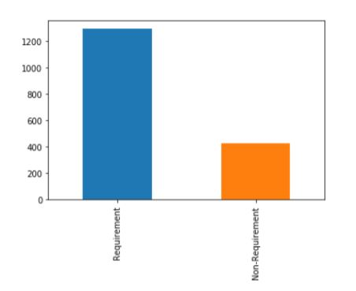

This dataset was used for binary classification considering different scenarios. Firstly, most common words in the categories were identified to have a look into the text in the two categories. Figure 3 shows the most common words in Requirement category and Figure 4 shows the most common words in the Non-Requirement category. Two different libraries namely NLTK and Spacy available in python were used in the pre-processing of text data and their effects on the accuracies of machine learning models used for binary text classification were observed. Table 1 shows the results of text classification using NLTK library for text pre-processing. Table 2 include the results of text classification using Spacy library for text pre-processing

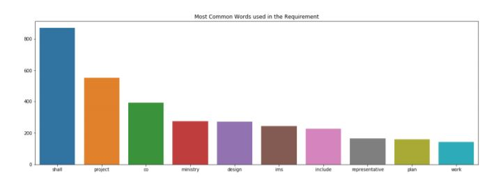

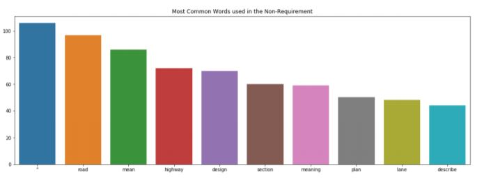

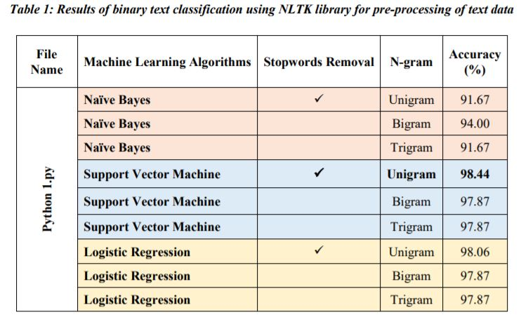

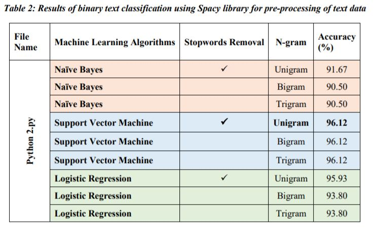

The performance of three different text classification models on our dataset were observed. Following three classifiers were used in first stage of our study.
1. Naïve Bayesian (NB)
2. Support Vector Machines (SVM)
3. Logistic Regression (LR)

In addition to this, n-gram based text classification was also performed. We used unigrams, bigrams and trigrams for our binary text classification task and the behaviour of models along with the variation in results were observed. In Bigram, the model considers a phrase of two consecutive words as a single token and similarly it considers a phrase of three consecutive words as a single token in trigram.

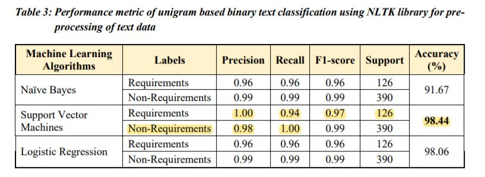 

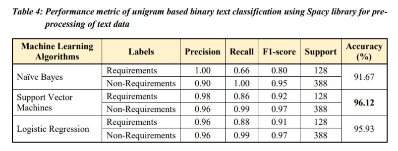

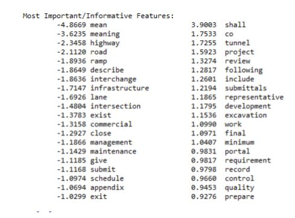

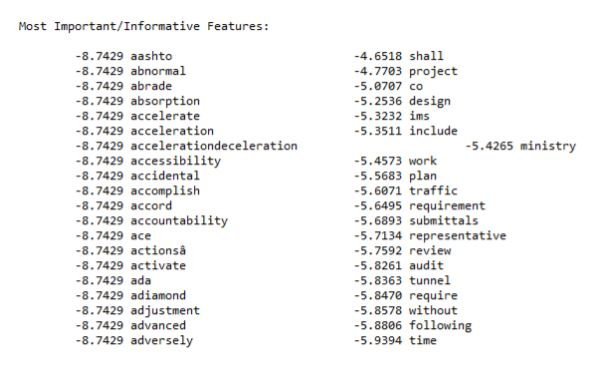

<h4> Phase-2: Multi-class Text Classification </h4>

In stage 2, the requirements text was further categorized into three predefined classes namely “Design”, “Construction” and “O&M”. In this part of the project, we used more than 3000 statements in dataset that were unequally distributed along the three classes as shown in Figure 10. The following machine learning methods were used in this phase 2.

1. Naïve Bayesian (NB)
2. Support Vector Machines (SVM)
3. Logistic Regression (LR)
4. Feedforward Neural Networks

In our reporting below, we have reported the model setting which provided the best results. For example, for the Feed Forward Network, we have tried different numbers of epochs, batch sizes, activation functions, number of hidden layers, and so on. However, the model settings specified below were proven to provide the best results across all what we have tested. For sure we haven’t tested all combinations for all models as this is virtually impossible to perform, but rather made random changes and tried to maintain the better results when they occur by modifying other variables in the models. 

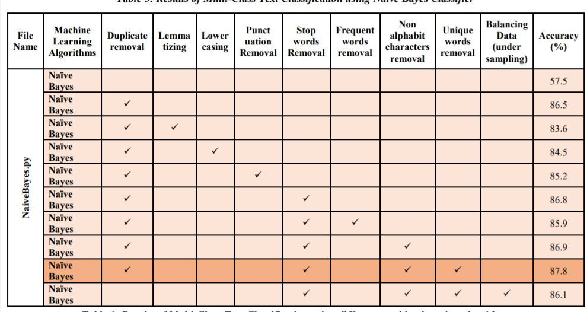

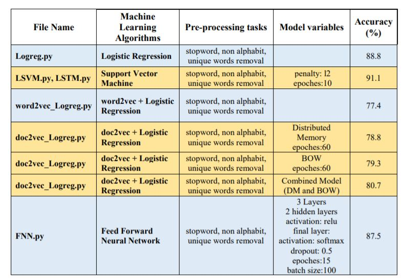

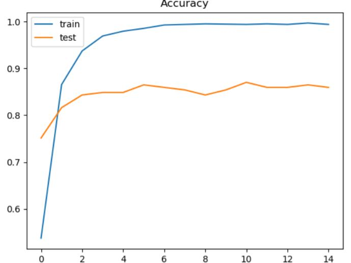

<h3> Conclussion </h3> 

In conclusion, this study has found that the requirement processing task in civil construction industry can be automated using text mining and natural language processing techniques. The machine learning algorithms tested in this study has shown the promising results. The results obtained showed that the unigram-based text classification gives best performance than bigram or trigram base text classification on our data. Similarly, pre-processing using NLTK library gives better results for text classification than using Spacing library. Finally, support vector machines algorithm (SVM) algorithm has been found to be the best classification model to classify the text documents in to different categories. For binary as well as multiclass text classification, SVM gave better results than naïve Bayes, logistic regression and feedforward neural network with an accuracy of 98.44% for binary classification and 91.10% for multiclass text classification. This study is expected to reduce the reading time of industry professionals spent in extracting the important information from text documents.
